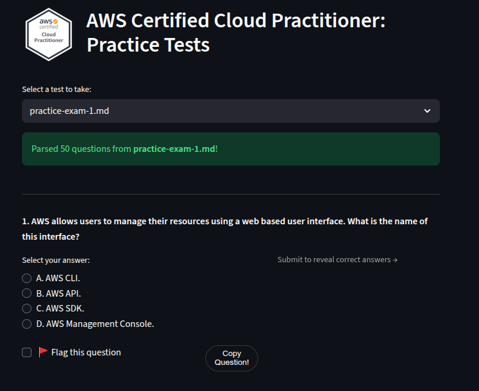

# AWS Certified Cloud Practitioner Practice
This repository provides a user friendly test environment which allows you to take the AWS CCP practice tests.

# Contents
The repository was built on top of the [repository](https://github.com/kananinirav/AWS-Certified-Cloud-Practitioner-Notes/blob/master/practice-exam/exams.md). It provides 23 practice tests in a test environment. User get's a score at the click of a button and can download an excel file for review purposes.

* **answer_remover.py**: It takes in the dir of the md files and will separate the question and answers in md files. (Not needed as parsed files are already provided)

* **test_application.py**: It takes the name of the dir of question and answers, and would host an application for users to give a simulated exam.

# How to Run locally
* Clone the Repo
* *streamlit run test_application.py*

# Run using Docker
* *docker run --name awsccp-app -p 8501:8501 gurudeepsingh/awsccp-practice-test*

This will pull the Docker image from dockerhub and will launch the app allowing the user to run the app in a container. The downloaded review file will be available in ./excels folder via the bind mount.

# Dependencies
*pip install --no-cache-dir -r requirements.txt*
* Streamlit --> *pip install streamlit*
* openpyxl --> *pip install openpyxl*
* pandas --> *pip install pandas*
